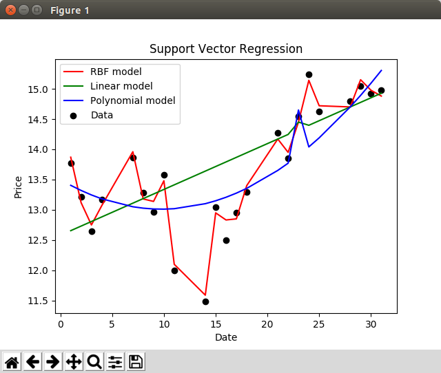
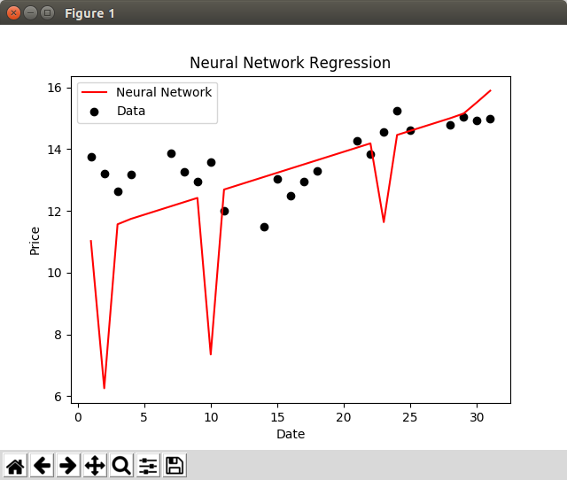

# Data-Science-by-Siraj-Raval
Challenge solutions of [Learn Python for Data Science by Siraj Raval on Youtube](https://www.youtube.com/playlist?list=PL2-dafEMk2A6QKz1mrk1uIGfHkC1zZ6UU)

### Gender Classification
[Lesson #1](https://www.youtube.com/watch?v=T5pRlIbr6gg)

Output -
```
----SVM----
Prediction for [190, 70, 43] - male
Accuracy over whole dataset - 100.0 %

----K-Neighbors----
Prediction for [190, 70, 43] - male
Accuracy over whole dataset - 72.73 %

----Decision Tree----
Prediction for [190, 70, 43] - male
Accuracy over whole dataset - 100.0 %

Highest accuracy of 100.0 % attained by SVM
```

### Twitter Sentiment Analysis
[Lesson #2](https://www.youtube.com/watch?v=o_OZdbCzHUA)

Output -<br/>
Check out the resultant CSV file [here](output.csv)

### Predicting Stock Prices
[Lesson #4](https://www.youtube.com/watch?v=SSu00IRRraY)

Output -<br/>

```
RBF SVR - 15.1155873791
Linear SVR - 14.8779798357
Polynomial SVR - 14.95025451
Neural Network - [[ 15.15664768]]
```

### Deep Dream in TensorFlow
[Lesson #5](https://www.youtube.com/watch?v=MrBzgvUNr4w)

Output -<br/>
GIF of the first 30 frames<br/>


### Genetic Algorithms
[Lesson #6](https://www.youtube.com/watch?v=dSofAXnnFrY)

Output -<br/>
```
Generation 1 - Current best internal CV score: 0.35872131555702474
Generation 2 - Current best internal CV score: 0.35872131555702474
Generation 3 - Current best internal CV score: 0.35872131555702474
Generation 4 - Current best internal CV score: 0.35872131555702474
Generation 5 - Current best internal CV score: 0.35872131555702474                                                           

Best pipeline: GradientBoostingRegressor(input_matrix, GradientBoostingRegressor__alpha=0.99, GradientBoostingRegressor__learning_rate=0.1, GradientBoostingRegressor__loss=ls, GradientBoostingRegressor__max_depth=DEFAULT, GradientBoostingRegressor__max_features=0.7, GradientBoostingRegressor__min_samples_leaf=3, GradientBoostingRegressor__min_samples_split=13, GradientBoostingRegressor__n_estimators=DEFAULT, GradientBoostingRegressor__subsample=0.95)
Accuracy: 0.347528253906
```
